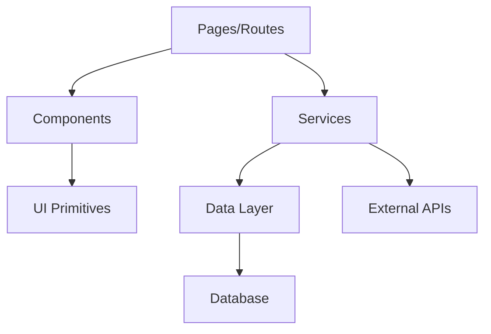

# Project Sitemap

## Goal

Generate a comprehensive, structured sitemap of the entire project so any AI agent or developer can rapidly understand the codebase architecture, modules, data flow, and key systems — enabling effective continuation of work without re-discovery.

## Core Rules

1. **Accuracy over speed** — every path, module, and relationship must reflect the actual codebase.
2. **Concise but complete** — capture all meaningful structure without noise (skip generated files, deps, caches).
3. **Machine-readable** — output must be parseable by AI agents for quick context loading.
4. **Living document** — update the sitemap whenever significant structural changes occur.
5. **Context-rich** — each entry should carry enough context to understand its purpose without opening the file.

## When to Trigger

- First time working on a new/unfamiliar project
- After major refactoring, feature additions, or architectural changes
- When onboarding a new AI agent session or developer
- User explicitly requests sitemap generation
- Project structure has changed significantly since last sitemap

## Process

### Phase 1: Discovery

Scan and identify:

1. **Root config** — package.json, composer.json, Cargo.toml, pyproject.toml, etc. → identify stack, framework, versions
2. **Framework** — Next.js, Laravel, SvelteKit, Django, etc. → determines conventional structure
3. **Entry points** — main files, index files, route definitions, CLI entry
4. **Directory layout** — top-level dirs and their roles
5. **Ignore patterns** — .gitignore, framework-generated dirs (node_modules, vendor, .next, __pycache__, dist, build)

### Phase 2: Deep Scan

For each meaningful directory, classify and document:

| Classification | Examples | Capture |
|---------------|----------|---------|
| **Routes/Pages** | pages/, routes/, app/ | Path → Component → Layout hierarchy |
| **API Endpoints** | api/, controllers/, routes/ | Method + Path + Handler + Middleware |
| **Components** | components/, ui/, widgets/ | Name + Props/Interface + Used-by |
| **Services/Logic** | services/, lib/, utils/, helpers/ | Name + Purpose + Dependencies |
| **Data Layer** | models/, schemas/, migrations/, prisma/ | Entity + Fields + Relations |
| **State Management** | stores/, context/, redux/ | Store name + State shape + Actions |
| **Config** | config/, .env.example, settings/ | Key configs + Environment vars |
| **Static Assets** | public/, static/, assets/ | Types + Organization |
| **Tests** | tests/, __tests__/, spec/ | Coverage areas + Test framework |
| **Docs** | docs/, README, CHANGELOG | Available documentation |
| **CI/CD** | .github/, Dockerfile, docker-compose | Pipeline + Deploy targets |
| **Types/Interfaces** | types/, interfaces/, @types/ | Shared type definitions |

### Phase 3: Relationship Mapping

Map critical relationships:

1. **Data flow** — Request → Middleware → Controller → Service → Repository → Database
2. **Component tree** — Layout → Page → Section → Component hierarchy
3. **Module dependencies** — which modules import from which
4. **Auth flow** — Login → Token → Guard → Protected routes
5. **State flow** — Action → Store → Component → UI update
6. **External integrations** — APIs, webhooks, third-party services

### Phase 4: Generate Sitemap

## Output Format

Generate the sitemap as `PROJECT_SITEMAP.md` in the project root:

```markdown
# Project Sitemap
> Auto-generated: [date] | Stack: [framework] [version] | Last commit: [hash]

## Quick Overview
- **Project**: [name] — [one-line description]
- **Stack**: [frontend] + [backend] + [database] + [key tools]
- **Architecture**: [pattern — MVC, Clean, Modular, etc.]
- **Entry Point**: [main entry file]

## Directory Map

```
[project-root]/
├── src/                    # Source code
│   ├── app/                # App router / pages
│   │   ├── (auth)/         # Auth-grouped routes
│   │   │   ├── login/      # Login page
│   │   │   └── register/   # Registration page
│   │   ├── dashboard/      # Dashboard (protected)
│   │   └── api/            # API routes
│   │       ├── auth/       # Auth endpoints
│   │       └── users/      # User CRUD
│   ├── components/         # Reusable UI components
│   │   ├── ui/             # Base UI primitives
│   │   └── features/       # Feature-specific components
│   ├── lib/                # Utilities & helpers
│   ├── services/           # Business logic
│   └── types/              # TypeScript definitions
├── prisma/                 # Database schema & migrations
├── public/                 # Static assets
└── tests/                  # Test suites
```

## Route Map

### Pages/Views
| Route | Component | Layout | Auth | Description |
|-------|-----------|--------|------|-------------|
| `/` | HomePage | MainLayout | No | Landing page |
| `/dashboard` | Dashboard | DashLayout | Yes | User dashboard |

### API Endpoints
| Method | Path | Handler | Auth | Description |
|--------|------|---------|------|-------------|
| POST | `/api/auth/login` | authController.login | No | User login |
| GET | `/api/users` | userController.list | Admin | List users |

## Data Models

| Model | Table | Key Fields | Relations |
|-------|-------|------------|-----------|
| User | users | id, email, name, role | → Posts, → Profile |
| Post | posts | id, title, userId | → User, → Comments |

## Key Systems

### Authentication
- **Type**: [JWT / Session / OAuth]
- **Provider**: [file/service]
- **Guard**: [middleware/file]
- **Protected routes**: [list]

### State Management
- **Tool**: [Redux / Zustand / Pinia / Context]
- **Stores**: [list with purpose]

### External Integrations
| Service | Purpose | Config |
|---------|---------|--------|
| Stripe | Payments | .env STRIPE_KEY |
| SendGrid | Email | .env SENDGRID_KEY |

## Module Dependency Graph



## Config & Environment

| Variable | Purpose | Required |
|----------|---------|----------|
| DATABASE_URL | DB connection | Yes |
| JWT_SECRET | Token signing | Yes |
| API_KEY | External API | Yes |

## File Statistics
- **Total files**: [count]
- **Source files**: [count]
- **Test files**: [count]
- **Largest files**: [top 5 with line counts]
- **TODO/FIXME count**: [count]
```

## Adaptation Rules

Adapt the sitemap to the project's actual stack:

| Stack | Focus Areas |
|-------|-------------|
| **Next.js/Nuxt/SvelteKit** | App router, pages, API routes, middleware, layouts |
| **Laravel/Rails/Django** | Routes, controllers, models, migrations, blade/views |
| **React SPA** | Component tree, routing, state, API calls |
| **Monorepo** | Package map, shared libs, workspace dependencies |
| **API-only** | Endpoints, middleware, validators, serializers |
| **Mobile (RN/Flutter)** | Screens, navigation, native modules, platform-specific |

## Update Protocol

When updating an existing sitemap:

1. Compare current structure against existing sitemap
2. Mark new additions with `[NEW]`
3. Mark removals with `[REMOVED]`
4. Mark moved items with `[MOVED from → to]`
5. Update statistics and date
6. Preserve any manual annotations added by developers

## Quality Checklist

- [ ] All directories with source code are mapped?
- [ ] Route map matches actual routing config?
- [ ] API endpoints match actual route definitions?
- [ ] Data models match actual schema/migrations?
- [ ] Auth flow accurately documented?
- [ ] External integrations listed?
- [ ] Environment variables documented?
- [ ] File statistics current?
- [ ] Mermaid diagram renders correctly?
- [ ] No generated/ignored directories included?
- [ ] Sitemap date and stack info current?
