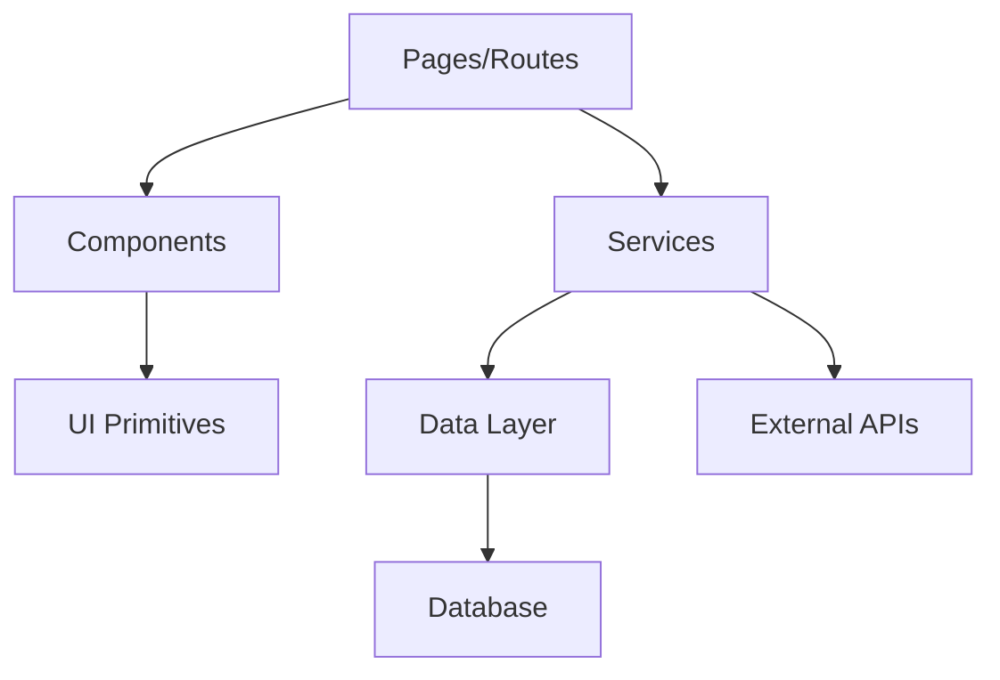

# Project Sitemap

## Goal

Generate and maintain a comprehensive, structured sitemap (`PROJECT_SITEMAP.md`) so any AI agent or developer can rapidly understand the codebase — enabling effective continuation of work without re-discovery.

## Core Rules

1. **Accuracy over speed** — every path, module, and relationship must reflect the actual codebase.
2. **Concise but complete** — capture all meaningful structure without noise (skip generated files, deps, caches).
3. **Machine-readable** — output must be parseable by AI agents for quick context loading.
4. **Living document** — auto-sync with every structural change. Sitemap must always match current project state.
5. **Context-rich** — each entry should carry enough context to understand its purpose without opening the file.
6. **Security-first** — never expose secrets, credentials, internal IPs, or sensitive config values in the sitemap.

## Safe Operating Constraints

**Do**: Map directories, files, routes, models, services, integrations. Include public config keys. Document architecture patterns.

**Don't**: Include `.env` values (only key names). Expose API secrets, tokens, passwords. Include user data or PII. Map `node_modules`, `vendor`, `.git`, `dist`, `build`, `__pycache__`, `.next`, `.nuxt` internals.

**Escalate when**: Project uses git submodules (confirm inclusion scope). Monorepo detected (confirm which packages to map). Symlinks detected (confirm resolution). Project exceeds 500 source files (confirm depth level).

## When to Trigger

### Auto-Trigger (AI must do automatically)

After completing any task that:
- Adds, removes, or renames files/directories
- Creates new routes, pages, or API endpoints
- Adds or modifies database models/migrations
- Changes authentication or authorization flow
- Adds new external integrations or services
- Modifies project configuration or environment variables
- Refactors module structure or moves files

**Procedure**: After task completion → check if `PROJECT_SITEMAP.md` exists → if yes, update affected sections only → if no, generate full sitemap.

### Manual Trigger

- First time working on a new/unfamiliar project
- User explicitly requests sitemap generation
- When onboarding a new AI agent session or developer

## Process

### Phase 1: Discovery

Scan and identify:

1. **Root config** — package.json, composer.json, Cargo.toml, pyproject.toml, go.mod, etc. → identify stack, framework, versions
2. **Framework** — Next.js, Laravel, SvelteKit, Django, Rails, etc. → determines conventional structure
3. **Entry points** — main files, index files, route definitions, CLI entry
4. **Directory layout** — top-level dirs and their roles
5. **Ignore patterns** — .gitignore, framework-generated dirs

### Phase 2: Deep Scan

For each meaningful directory, classify and document:

| Classification | Examples | Capture |
|---------------|----------|---------|
| **Routes/Pages** | pages/, routes/, app/ | Path → Component → Layout hierarchy |
| **API Endpoints** | api/, controllers/, routes/ | Method + Path + Handler + Middleware |
| **Components** | components/, ui/, widgets/ | Name + Props/Interface + Used-by |
| **Services/Logic** | services/, lib/, utils/, helpers/ | Name + Purpose + Dependencies |
| **Data Layer** | models/, schemas/, migrations/, prisma/ | Entity + Fields + Relations |
| **State Management** | stores/, context/, redux/ | Store name + State shape + Actions |
| **Config** | config/, .env.example, settings/ | Key names + Purpose (no values) |
| **Static Assets** | public/, static/, assets/ | Types + Organization |
| **Tests** | tests/, __tests__/, spec/ | Coverage areas + Test framework |
| **Docs** | docs/, README, CHANGELOG | Available documentation |
| **CI/CD** | .github/, Dockerfile, docker-compose | Pipeline + Deploy targets |
| **Types/Interfaces** | types/, interfaces/, @types/ | Shared type definitions |

### Phase 3: Relationship Mapping

Map critical relationships:

1. **Data flow** — Request → Middleware → Controller → Service → Repository → Database
2. **Component tree** — Layout → Page → Section → Component hierarchy
3. **Module dependencies** — which modules import from which
4. **Auth flow** — Login → Token → Guard → Protected routes
5. **State flow** — Action → Store → Component → UI update
6. **External integrations** — APIs, webhooks, third-party services

### Phase 4: Generate Sitemap

## Scale Handling

Adapt depth and detail based on project size:

| Project Size | Files | Directory Depth | Detail Level |
|-------------|-------|-----------------|--------------|
| **Small** | <50 | Full (all levels) | Every file listed |
| **Medium** | 50-200 | 3-4 levels | Key files + summaries |
| **Large** | 200-500 | 2-3 levels | Directory summaries + key files |
| **Enterprise** | 500+ | 2 levels | Package/module summaries only |
| **Monorepo** | Varies | Per-package mapping | Root overview + per-package detail |

## Edge Cases

| Scenario | Handling |
|----------|----------|
| **Git submodules** | List as `[SUBMODULE]` with repo URL, don't map internals unless requested |
| **Symlinks** | Resolve and note with `[SYMLINK → target]` |
| **Generated code** | Mark as `[GENERATED]`, don't detail internals (e.g., GraphQL codegen, Prisma client) |
| **Multi-language project** | Group by language/runtime, note build system for each |
| **Workspace/Monorepo** | Create root map + individual package maps, show inter-package deps |
| **Empty directories** | Skip unless they serve a convention purpose (e.g., `.gitkeep`) |
| **Binary files** | List categories (images, fonts, etc.) with count, don't list individually |
| **Vendor lock files** | Note existence only (package-lock.json, yarn.lock, composer.lock) |

## Output Format

Generate as `PROJECT_SITEMAP.md` in project root:

````markdown
# Project Sitemap
> Auto-generated: [date] | Version: [version from package/config] | Stack: [framework] [version]

## Quick Overview
- **Project**: [name] — [one-line description]
- **Stack**: [frontend] + [backend] + [database] + [key tools]
- **Architecture**: [pattern — MVC, Clean, Modular, etc.]
- **Entry Point**: [main entry file]
- **Last Updated**: [date + reason for update]

## Directory Map

```
[project-root]/
├── src/                    # Source code
│   ├── app/                # App router / pages
│   │   ├── (auth)/         # Auth-grouped routes
│   │   │   ├── login/      # Login page
│   │   │   └── register/   # Registration page
│   │   ├── dashboard/      # Dashboard (protected)
│   │   └── api/            # API routes
│   │       ├── auth/       # Auth endpoints
│   │       └── users/      # User CRUD
│   ├── components/         # Reusable UI components
│   │   ├── ui/             # Base UI primitives
│   │   └── features/       # Feature-specific components
│   ├── lib/                # Utilities & helpers
│   ├── services/           # Business logic
│   └── types/              # TypeScript definitions
├── prisma/                 # Database schema & migrations
├── public/                 # Static assets
└── tests/                  # Test suites
```

## Route Map

### Pages/Views
| Route | Component | Layout | Auth | Description |
|-------|-----------|--------|------|-------------|
| `/` | HomePage | MainLayout | No | Landing page |
| `/dashboard` | Dashboard | DashLayout | Yes | User dashboard |

### API Endpoints
| Method | Path | Handler | Auth | Description |
|--------|------|---------|------|-------------|
| POST | `/api/auth/login` | authController.login | No | User login |
| GET | `/api/users` | userController.list | Admin | List users |

## Data Models

| Model | Table | Key Fields | Relations |
|-------|-------|------------|-----------|
| User | users | id, email, name, role | → Posts, → Profile |
| Post | posts | id, title, userId | → User, → Comments |

## Key Systems

### Authentication
- **Type**: [JWT / Session / OAuth]
- **Provider**: [file/service]
- **Guard**: [middleware/file]
- **Protected routes**: [list]

### State Management
- **Tool**: [Redux / Zustand / Pinia / Context]
- **Stores**: [list with purpose]

### External Integrations
| Service | Purpose | Config Key |
|---------|---------|------------|
| Stripe | Payments | STRIPE_KEY |
| SendGrid | Email | SENDGRID_KEY |

## Module Dependency Graph



## Config & Environment

| Variable | Purpose | Required | Category |
|----------|---------|----------|----------|
| DATABASE_URL | DB connection | Yes | Database |
| JWT_SECRET | Token signing | Yes | Auth |
| API_KEY | External API | Yes | Integration |

## File Statistics
- **Total files**: [count]
- **Source files**: [count]
- **Test files**: [count]
- **Largest files**: [top 5 with line counts]
- **TODO/FIXME count**: [count]

## Change Log
| Date | Change | Affected Sections |
|------|--------|-------------------|
| [date] | Initial generation | All |
| [date] | Added user profile feature | Routes, Models, Components |
````

## Adaptation Rules

Adapt the sitemap to the project's actual stack:

| Stack | Focus Areas |
|-------|-------------|
| **Next.js/Nuxt/SvelteKit** | App router, pages, API routes, middleware, layouts, server/client boundaries |
| **Laravel/Rails/Django** | Routes, controllers, models, migrations, blade/views, artisan commands |
| **React SPA** | Component tree, routing, state, API calls, build config |
| **Monorepo** | Package map, shared libs, workspace dependencies, build order |
| **API-only** | Endpoints, middleware, validators, serializers, rate limiting |
| **Mobile (RN/Flutter)** | Screens, navigation, native modules, platform-specific code |
| **Desktop (Electron/Tauri)** | Main/renderer process, IPC channels, native APIs |
| **CLI Tool** | Commands, flags, config loading, output formatters |

## Auto-Sync Protocol

### After Every Task Completion

```
1. Check: Does PROJECT_SITEMAP.md exist?
   ├── No  → Full generation (Phase 1-4)
   └── Yes → Incremental update (below)

2. Incremental Update:
   a. Identify which files/dirs changed during this task
   b. Map changes to sitemap sections:
      - New/deleted files     → Directory Map
      - New/modified routes   → Route Map
      - Schema changes        → Data Models
      - New services/libs     → Key Systems
      - Config changes        → Config & Environment
      - New integrations      → External Integrations
   c. Update only affected sections
   d. Update File Statistics
   e. Add entry to Change Log table
   f. Update "Last Updated" timestamp + reason
```

### Sync Validation

After update, verify:
- Directory Map reflects actual `ls`/`dir` output
- Route count matches actual route definitions
- Model count matches actual schema
- No stale entries from deleted files

## Update Protocol

When updating an existing sitemap:

1. Compare current structure against existing sitemap
2. Mark new additions with `[NEW]` in Change Log
3. Mark removals with `[REMOVED]` in Change Log
4. Mark moved items with `[MOVED from → to]` in Change Log
5. Update statistics and date
6. Preserve any manual annotations added by developers
7. Keep Change Log as append-only (don't delete old entries)

## Error Recovery

| Failure | Protocol |
|---------|----------|
| Sitemap out of sync | Full regeneration, note discrepancies in Change Log |
| Partial scan (large project) | Document scanned vs unscanned areas, mark `[PARTIAL]` |
| Conflicting structure | Flag with `[CONFLICT]`, describe both states, ask user |
| Missing permissions | Skip inaccessible dirs, mark `[NO ACCESS]` |
| Corrupted sitemap file | Regenerate from scratch, note in Change Log |

## Quality Checklist

- [ ] All directories with source code are mapped?
- [ ] Route map matches actual routing config?
- [ ] API endpoints match actual route definitions?
- [ ] Data models match actual schema/migrations?
- [ ] Auth flow accurately documented?
- [ ] External integrations listed?
- [ ] Environment variable names documented (no values)?
- [ ] File statistics current?
- [ ] Mermaid diagram renders correctly?
- [ ] No generated/ignored directories included?
- [ ] No secrets, credentials, or PII exposed?
- [ ] Sitemap date and version info current?
- [ ] Change Log has entry for this update?
- [ ] Scale-appropriate depth applied?
